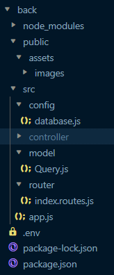

# Création d'un blog en React et Nodejs

## 1-La base de données:


## 2-La maquette:


## 3-Mise en place du projet node:
1- Création du dossier "exo-final" .   
2- Dans ce dossier, créer un dossier: `back`.   
3- A la racine du projet, créer un fichier .gitignore, pour que gitHub ignore les fichiers et dossiers trop sensibles.

### **- Dans le dossier `back`:**

- Installation dans le terminal du vscode
```bash
npm init -y
npm install nodemon -D
npm i dotenv mysql2 express bcrypt cors
```
- Dans le fichier `package.json`:   
On va ajouter ceci: 
```json
  "main": "src/app.js",
  "type": "module",
  "scripts": {
    "start": "node src/app.js",
    "dev": "nodemon src/app.js"
  },
```
- Ensuite on créé l'arborescence du dossier `back`.  

    

## Partie du dossier CLIENT
A la racine du projet, et dans le termnial, on fait quelques lignes de commande:
```bash 
  npm create vite@latest
```
  on nommera le dossier `client` avec REACT et javascript + swc
  on entre dans le répertoire `client`
  et on fait:
  ```bash
  npm install
  npm install react-router-dom react-redux @reduxjs/toolkit sass
  ```

  installation de fontawesome:
  ```bash
   npm i --save @fortawesome/fontawesome-svg-core
   npm i --save @fortawesome/react-fontawesome@latest

   npm i --save @fortawesome/free-solid-svg-icons

   npm i --save @fortawesomefree-brands-svg-icons

  ```
  pour icone du footer le brands